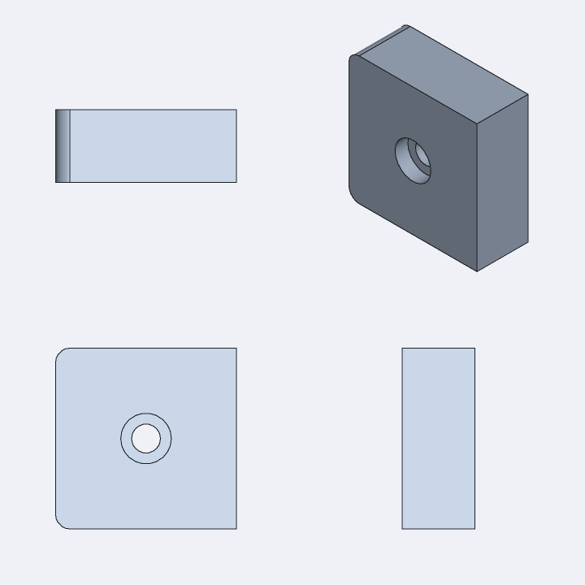

# Forge

An AI-first, SolidWorks-parity parametric CAD system for macOS 27 (Apple Silicon), built on
Open CASCADE, Swift 6 and Metal. Every capability is a typed command on a single command
bus, reachable from the UI, scripts, `forge-cli` and MCP alike.

- **Spec:** [SPEC.md](SPEC.md) · **Parity matrix:** [FEATURES.md](FEATURES.md) ·
  **Status:** [PROGRESS.md](PROGRESS.md) · **Decisions:** [docs/adr/](docs/adr/) ·
  **Licenses:** [docs/LICENSES.md](docs/LICENSES.md)
- **Milestone:** M0 (foundations). This is a multi-year project; see FEATURES.md for the
  honest state of every SolidWorks capability.



## Layout

```
Sources/
  CForgeKernel/   C++20 bridge over OCCT with a pure C ABI (include/forge_kernel.h)
  ForgeCore/      JSON values, structured errors, units, schema extraction, geometry math
  ForgeKernel/    Swift wrapper: Shape, Mesh, Kernel (no OCCT types leak)
  ForgeCommands/  Command protocol + registry, Engine (undo/redo, transactions, dry-run, batch)
  ForgeRender/    Camera, headless software renderer + PNG, picking, Metal viewport (macOS)
  ForgeMCP/       MCP server (stdio + Unix socket), tools generated from the command registry
  forge-cli/      Headless engine CLI
  ForgeApp/       SwiftUI shell (macOS only)
Tests/            Swift Testing suites + GoldenModelTests/Models/*.json
scripts/          build-occt.sh, bootstrap-linux.sh, make-app-bundle.sh, features.py
```

## Build

macOS 27 with Xcode 27:

```sh
scripts/build-occt.sh            # OCCT 8.0.1 → Vendor/occt/darwin-arm64 (+ xcframeworks)
swift build && swift test
swift run ForgeApp               # or scripts/make-app-bundle.sh → build/Forge.app
```

Linux (headless engine, CI):

```sh
scripts/bootstrap-linux.sh       # Swift 6.4.0 + Ubuntu OCCT 7.6 packages
export PATH=/opt/swift/usr/bin:$PATH
swift build && swift test
# or against a self-built OCCT: FORGE_OCCT_PREFIX=/opt/occt-8.0.1 swift build
```

## Use it

```sh
forge-cli commands                               # every command
forge-cli describe body.create_box               # JSON Schemas, errors, examples
forge-cli run Tests/GoldenModelTests/Models/*.json   # scripts with expectations
forge-cli exec body.create_cylinder '{"radius": "0.5 in", "height": 20}'
forge-cli mcp [--socket /tmp/forge.sock]         # MCP server (stdio + optional socket)
```

MCP client configuration (e.g. Claude Code): `claude mcp add forge -- /path/to/forge-cli mcp`.

A script is JSON: `{"forge_script": 1, "commands": [{"command": "...", "params": {...}}],
"expect": {"bodies": [{"body": "body-1", "volume_mm3": {"value": 1000, "tol": 1e-6}}]}}`.
