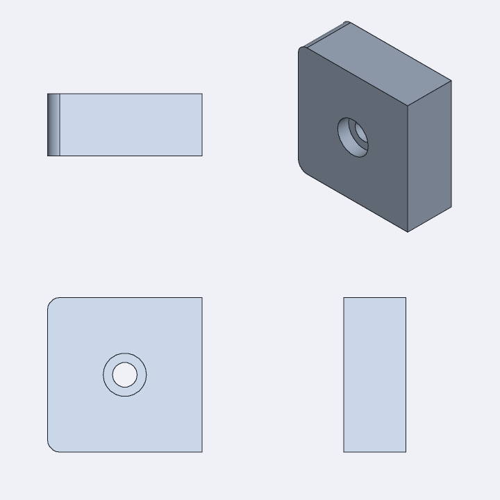

# Forge

An AI-first, SolidWorks-parity parametric CAD system for macOS 27 (Apple Silicon), built on
Open CASCADE, Swift 6 and Metal. Every capability is a typed command on a single command
bus, reachable from the UI, scripts, `forge-cli` and MCP alike.

- **Spec:** [SPEC.md](SPEC.md) · **Parity matrix:** [FEATURES.md](FEATURES.md) ·
  **Status:** [PROGRESS.md](PROGRESS.md) · **Decisions:** [docs/adr/](docs/adr/) ·
  **Licenses:** [docs/LICENSES.md](docs/LICENSES.md)
- **Milestone:** M0 foundations are implemented; M1 sketching and M2 part modeling are in progress. This is a multi-year project; see FEATURES.md for the
  honest state of every SolidWorks capability.



## Layout

```
Sources/
  CForgeKernel/   C++20 bridge over OCCT with a pure C ABI (include/forge_kernel.h)
  ForgeCore/      JSON values, structured errors, units, schema extraction, geometry math
  ForgeKernel/    Swift wrapper: Shape, Mesh, Kernel (no OCCT types leak)
  ForgeSketch/    2D sketches: entities, constraint solver (DOF, conflicts), profiles
  ForgeCommands/  Command protocol + registry, Engine (undo/redo, transactions, dry-run, batch)
  ForgeRender/    Camera, headless software renderer + PNG, picking, Metal viewport (macOS)
  ForgeMCP/       MCP server (stdio + Unix socket), tools generated from the command registry
  forge-cli/      Headless engine CLI
  ForgeApp/       SwiftUI shell (macOS only)
Tests/            Swift Testing suites + GoldenModelTests/Models/*.json
scripts/          build-occt.sh, bootstrap-linux.sh, install-linux.sh, make-app-bundle.sh, features.py
```

## Build

macOS 27 with Xcode 27:

```sh
scripts/build-occt.sh            # OCCT 8.0.1 → Vendor/occt/darwin-arm64 (+ xcframeworks)
swift build && swift test
swift run ForgeApp               # or scripts/make-app-bundle.sh → build/Forge.app
```

Linux desktop (CachyOS / Arch, Ubuntu) — the app `forge` (GTK 4 + OpenGL) and `forge-cli`:

```sh
scripts/install-linux.sh         # packages, swift.org toolchain, release build → ~/.local
forge                            # or Forge in the application menu
```

Linux development (engine + app, CI):

```sh
scripts/bootstrap-linux.sh       # Swift 6.4.0 + Ubuntu OCCT 7.6 + GTK 4 packages
export PATH=/opt/swift/usr/bin:$PATH
swift build && swift test
# or against a self-built OCCT: FORGE_OCCT_PREFIX=/opt/occt-8.0.1 swift build
```

## Use it

```sh
forge-cli commands                               # every command
forge-cli describe body.create_box               # JSON Schemas, errors, examples
forge-cli run Tests/GoldenModelTests/Models/*.json   # scripts with expectations
forge-cli exec body.create_cylinder '{"radius": "0.5 in", "height": 20}'
forge-cli mcp [--socket /tmp/forge.sock]         # MCP server (stdio + optional socket)
```

MCP client configuration (e.g. Claude Code): `claude mcp add forge -- /path/to/forge-cli mcp`.

MCP feature workflows are available directly through `get_feature_tree`, `get_feature`,
`get_feature_dependencies`, `reorder_feature`, `edit_feature`, `rename_feature`,
`suppress_feature`, `rollback_features`, `repair_reference`, and `rebuild`. Read or subscribe to `forge://document/features` for parameters and rebuild
status. Create a document before an atomic batch; save/export and document switching
must be separate calls (or explicitly non-atomic). Failed batches return `isError: true`
and a structured `failed_index`; a non-atomic batch can retain earlier successful edits.

Use **File → Import STEP** (or MCP `import_step` / command `document.import_step`)
in a new part before creating sketches or features. Repeated imports can add more solid
bodies before modeling starts. Original imported BREP is embedded in schema-3 documents,
so later rebuilds do not need the source STEP file. Assembly structure, PMI, source
names/colors, surface-only files and automatic healing are not imported.

Feature context menus provide **Parent/Child**, **Move Up** and **Move Down**. The
matching `feature.dependencies` and `feature.reorder` commands inspect direct/transitive
relationships and validate proposed moves before committing. Reordering requires the
rollback bar at the end, preserves dependencies and output ids, and refuses invalid
rebuilds. Some geometrically possible moves are deliberately refused when implicit
all-body scopes would change.

**Interference Detection** checks all bodies, or a selected subset, and lists overlap
volume in mm³; selecting a result highlights both bodies. MCP `check_interference` and
command `query.interference` return exact BREP overlap volumes and bounding boxes.
Touching alone is not interference. Calls support at most 100 bodies; this is a
multibody part check, not assembly interference or collision during motion.

The [workflow parity audit](docs/research/solidworks-parity-audit.md) describes remaining
SolidWorks functionality and acceptance criteria. This remains an early part modeler.

A script is JSON: `{"forge_script": 1, "commands": [{"command": "...", "params": {...}}],
"expect": {"bodies": [{"body": "body-1", "volume_mm3": {"value": 1000, "tol": 1e-6}}]}}`.

Select a planar part face and choose **Features → Sketch on Face** to draw directly
on it. **Normal To** aligns the view with a selected face or reference plane even
without opening a sketch. In sketch mode, **Select Model Geometry** lets you pick
part edges or faces; **Convert Entities** copies their projected boundaries into the
sketch. These are detached copies, not associative links; lines and parallel
circles/arcs are supported. **Split Entities** uses one click for lines/arcs and two
clicks on a closed circle/ellipse.

**Move/Copy Bodies** provides translation and optional rotation, copy, preview and
feature editing. Extrusion pages support **Up To Vertex** with model-coordinate
inputs in either direction. Body and feature tree menus include **Rename** on all
platforms. Lost sketch supports now block dependent features; use
`feature.repair_reference` to attach the sketch to a replacement planar support.

The [complete modeling gap inventory](docs/research/modeling-workflow-gaps.md)
accounts for all 1,000 matrix entries and documents remaining work.
