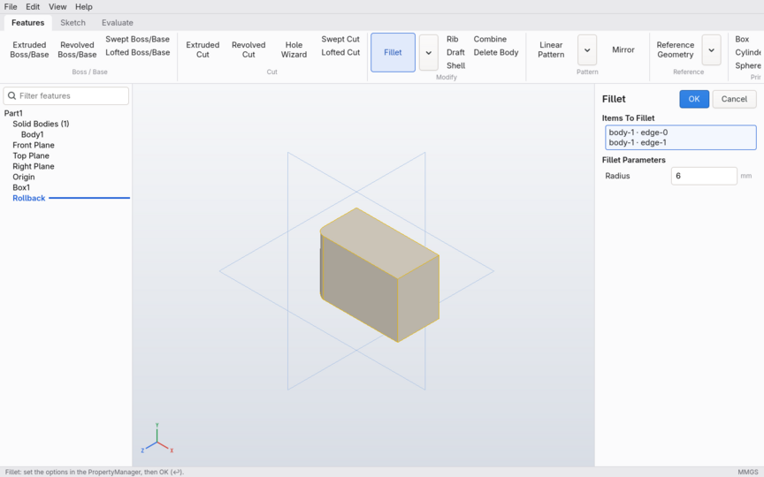

# ADR 0013 — Native Linux app

Status: accepted (2026-09-28)

## Context

The user runs CachyOS (Arch-based) and asked for a full Linux build, not only the headless
engine. Two things stood in the way.

- **No desktop app on Linux.** Only the macOS app (SwiftUI + Metal) and the Windows app
  (Win32 + Direct3D, ADR 0012) existed.
- **Installing Swift on Arch.** The AUR `swift-bin` package the user tried lacks toolchain
  files (`swift-frontend`, `swift-autolink-extract`), so no Swift package builds with it.
  The official swift.org Linux toolchain runs on CachyOS once two Ubuntu library names are
  available: `libncurses.so.6` (Arch ships only `libncursesw.so.6`) and `libxml2.so.2` (Arch's
  `libxml2-legacy`).

The Windows work already split the app into the shared model (`ForgeUI`), a Swift front end
(`Sources/ForgeWin`) that owns no platform code, and a plain C shell API
(`Sources/CForgeWin/include/CForgeWin.h`). That API covers the window, ribbon, tree,
PropertyManager, dialogs, and a viewport that executes `ForgeRender.ViewportPlan` draw lists.

## Decision

1. **A GTK 4 + OpenGL implementation of the same C API** (`Sources/CForgeWin/gtk`, C). The Swift
   front end builds unchanged as the `forge` executable (target `ForgeLinux`, sources
   `Sources/ForgeWin`).
   - **Window:** a GtkPopoverMenuBar with GActions and shortcuts; ribbon tabs and grouped
     buttons with flyout popovers; the tree as a GtkListBox (states, rollback bar, context
     popovers); the PropertyManager built from the control descriptions; status bar; the
     Modify box as an overlay.
   - **Dialogs:** GtkAlertDialog and GtkFileDialog, waited on in a nested main loop, because
     the API is synchronous.
   - **Viewport:** a GtkGLArea with an OpenGL 3.3 core profile.
     - The shaders are GLSL ports of the HLSL/Metal ones. Clip z is mapped from the plan's
       [0, w] to OpenGL's [-w, w], and colours are written as sRGB like the Metal and D3D
       targets.
     - Picking renders into two R32UI attachments.
     - Labels are drawn with Cairo/Pango into a texture composited over the frame.
     - Vertex data is kept on the CPU until the first draw, because the front end may create
       buffers before the GL context exists.
2. **Built when GTK 4 is present.** `Package.swift` asks pkg-config for `gtk4 epoxy`.
   `FORGE_LINUX_APP=1` requires them and `=0` leaves the app out. The engine still builds
   without GTK.
3. **`scripts/install-linux.sh` installs Forge on a desktop.**
   - Distribution packages: pacman on CachyOS/Arch, apt on Ubuntu.
   - The swift.org toolchain goes into `~/.local/share/forge`, checked against swift.org's
     signing keys. On Arch it gets a private `libncurses.so.6` link inside the toolchain's own
     library directory; nothing system-wide is changed.
   - Release binaries are built with `--static-swift-stdlib`, so they don't need the toolchain
     at run time.
   - `forge` and `forge-cli` are installed with a desktop entry and an icon into `~/.local`
     (or `/usr/local` with `--system`).

## Verification

- **Here, on Ubuntu 24.04 with GTK 4.14, under Xvfb with Mesa**, driven with xdotool:
  - the Box page's live translucent preview, and OK creates the body;
  - GPU picking returns the right face with its persistent id;
  - rotate and wheel zoom;
  - sketch mode: a closed triangle with inferred relations, and the Cairo labels;
  - the File menu, and Save through the GTK file dialog, which writes a valid .forgepart.
- **In the `cachyos/cachyos` container** (OCCT 7.9.3, GTK 4.22): `install-linux.sh` runs as a
  normal user with sudo, builds, installs, and the installed app passes its screenshot
  self-test.
- **CI:** the Linux job builds `forge` and runs `forge --screenshot` under Xvfb. A `cachyos`
  job runs the installer in the CachyOS container on every push.

Found on the way: the Windows/Linux front end never scheduled live previews during editing
(only its self-test did). It now recomputes them 120 ms after the page's inputs change, as the
macOS page does.

## Consequences

- One Swift front end serves Windows and Linux; a change to the shell API is made in
  `app.cpp`/`render.cpp` (Win32), `gtk/` (Linux) and `headless/` (the type-check stub).
- Like Windows, the Linux ribbon uses text buttons (the SVG icon set is not drawn yet), and
  there is no command palette, context toolbar or shortcut bar yet.
- The install downloads about 1.1 GB once (the Swift toolchain). A PKGBUILD / Flatpak is a
  possible follow-up.

The installed app on CachyOS (container, Xvfb, Mesa), running its screenshot self-test: a
Fillet with two picked edges and its live preview.

